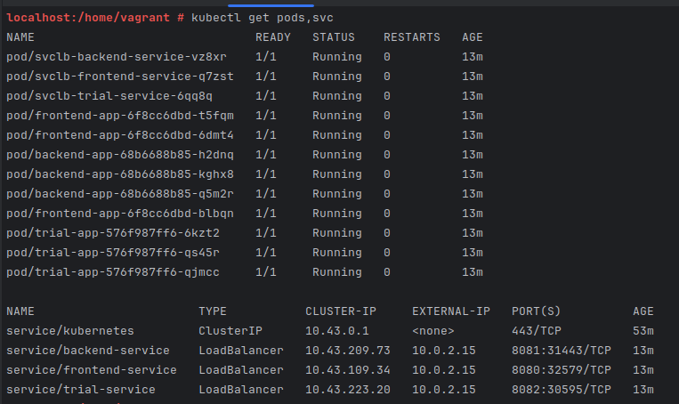
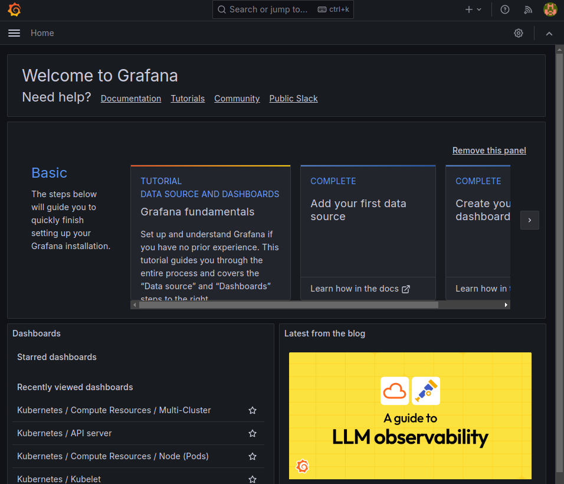
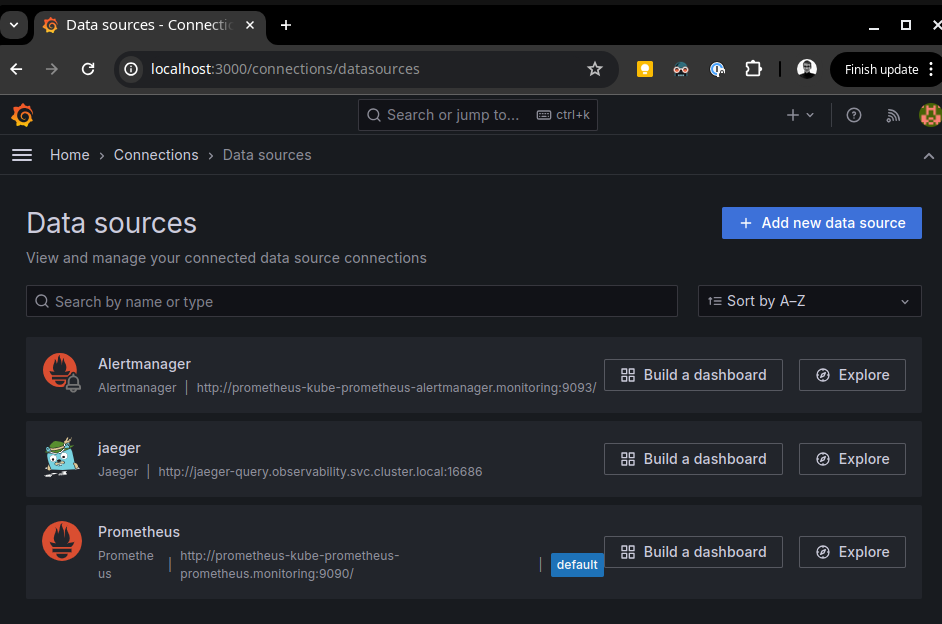
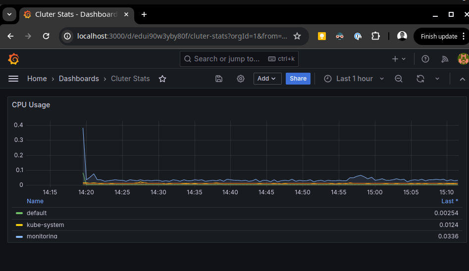
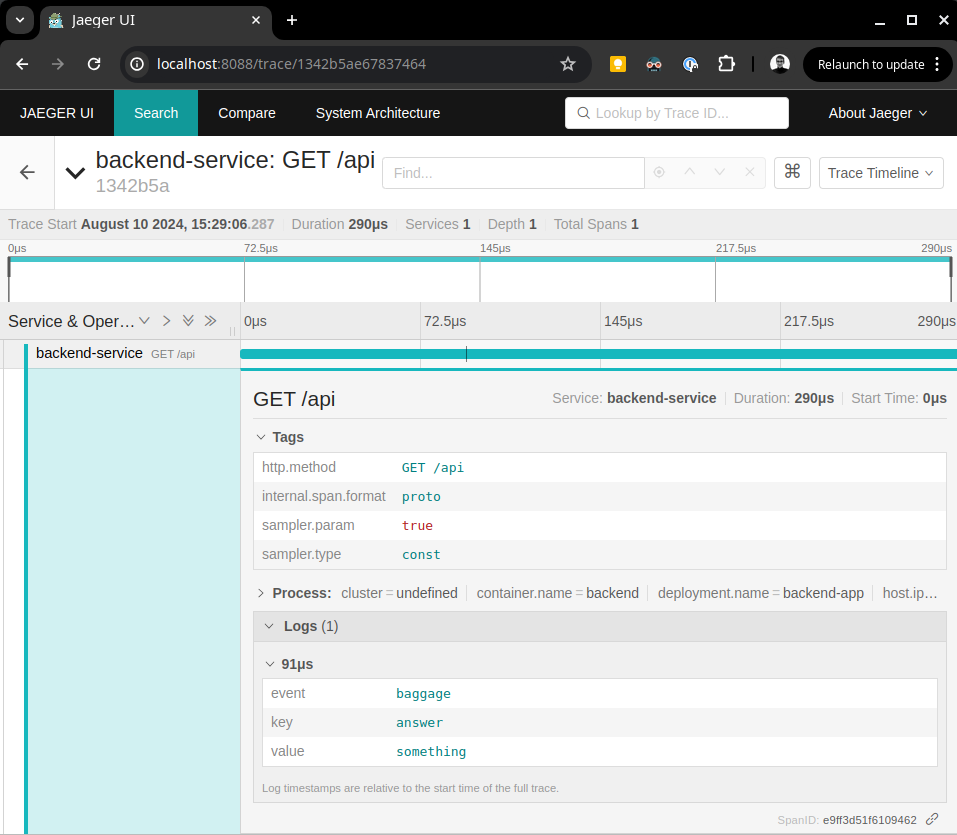
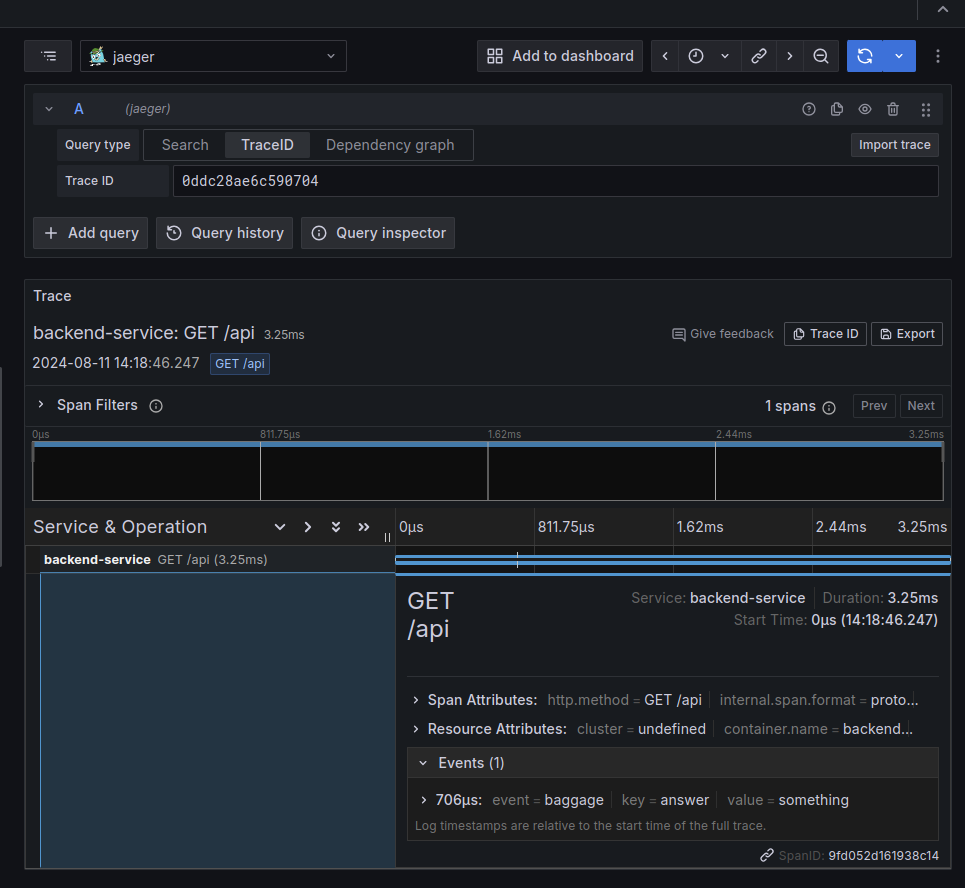

## Verify the monitoring installation

Running pods and services for all components:
```bash
kubectl get pods,svc
```



## Setup the Jaeger and Prometheus source
Expose Grafana to the internet and then setup Prometheus as a data source.

```bash
kubectl -n monitoring port-forward svc/prometheus-grafana --address 0.0.0.0 3000:80
```
Expose Jaeger:
```bash
kubectl -n observability port-forward svc/jaeger-query --address 0.0.0.0 16686:16686
```
Dashboards:


Data sources:


## Create a Basic Dashboard



## Describe SLO/SLI
*TODO:* Describe, in your own words, what the SLIs are, based on an SLO of *monthly uptime* and *request response time*.

## Creating SLI metrics.
*TODO:* It is important to know why we want to measure certain metrics for our customer. Describe in detail 5 metrics to measure these SLIs. 

## Create a Dashboard to measure our SLIs
*TODO:* Create a dashboard to measure the uptime of the frontend and backend services We will also want to measure to measure 40x and 50x errors. Create a dashboard that show these values over a 24 hour period and take a screenshot.

## Tracing our Flask App
Use the tracer to create and populate a span:
```
@app.route("/api")
def my_api():
    with tracer.start_span('GET /api') as span:
        span.set_tag('http.method', 'GET /api')
        answer = "something"
        span.set_baggage_item('answer', answer)
        return jsonify(repsonse=answer)
```

View the trace in Jaeger UI:


## Jaeger in Dashboards
Explore traces in grafana:


Trace duration in Grafana"

## Report Error

TROUBLE TICKET

Name: 
Slow GET /api 

Date: 
11 Aug 2024

Subject: 
Improve performance of GET /api endpoint

Affected Area: 
Endpoint GET /api

Severity: 
Warning

Description:
In the requests duration dashboard for `GET /api`, we are seeing ample slow requests(>5ms).
One example is trace d503c82. Investigate why users are experiencing latency here and see if we can come up with performance improvements

## Creating SLIs and SLOs
*TODO:* We want to create an SLO guaranteeing that our application has a 99.95% uptime per month. Name four SLIs that you would use to measure the success of this SLO.

## Building KPIs for our plan
*TODO*: Now that we have our SLIs and SLOs, create a list of 2-3 KPIs to accurately measure these metrics as well as a description of why those KPIs were chosen. We will make a dashboard for this, but first write them down here.

## Final Dashboard
*TODO*: Create a Dashboard containing graphs that capture all the metrics of your KPIs and adequately representing your SLIs and SLOs. Include a screenshot of the dashboard here, and write a text description of what graphs are represented in the dashboard.  
