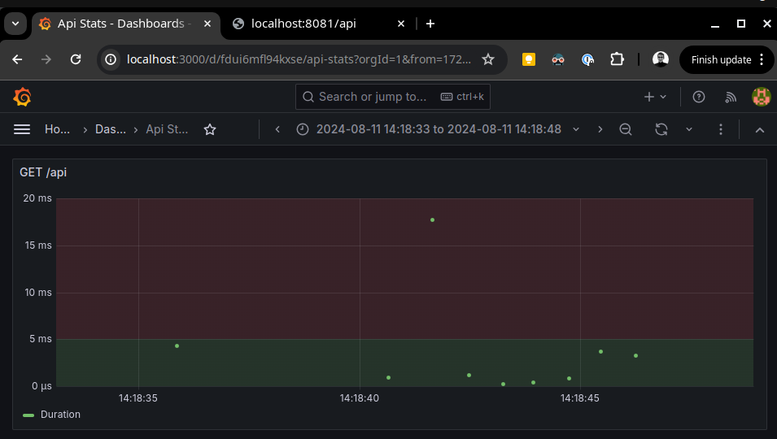

## Verify the monitoring installation

Running pods and services for all components:
```bash
kubectl get pods,svc
```


## Setup the Jaeger and Prometheus source
Expose Grafana to the internet and then setup Prometheus as a data source.

```bash
kubectl -n monitoring port-forward svc/prometheus-grafana --address 0.0.0.0 3000:80
```
Dashboards:


Data sources:


## Create a Basic Dashboard


## Describe SLO/SLI
Describe, in your own words, what the SLIs are, based on an SLO of *monthly uptime* and *request response time*.

Monthly uptime:
    The monthly uptime for the backend service is 95.00%, the target is 99.99%.
    The monthly uptime for the frontend service is 99.95%, the target is 99.99%.

Response time:
    The average request response time for the backend service is 70ms, the target is <50ms
    The max request response time for the backend service is 200ms, the target is <300ms

## Creating SLI metrics.
It is important to know why we want to measure certain metrics for our customers. Describe in detail 5 metrics to measure these SLIs. 
 
 - uptime - the time the service was running and reachable in a period e.g. month
 - latency - the duration the service took to service a user request
 - error count and failure rate - times an error occurred in a period or the time the error occurred from all occurrences(error frequency) 
 - resource saturation - CPU or Memory utilization is usually expressed as a percentage of CPU or Memory usage.
 - traffic - the number of requests per second reaching the service

## Create a Dashboard to measure our SLIs
Create a dashboard to measure the uptime of the frontend and backend services We will also want to measure to measure 40x and 50x errors. Create a dashboard that show these values over a 24 hour period and take a screenshot.

## Tracing our Flask App
Use the tracer to create and populate a span:
```
@app.route("/api")
def my_api():
    with tracer.start_span('GET /api') as span:
        span.set_tag('http.method', 'GET /api')
        answer = "something"
        span.set_baggage_item('answer', answer)
        return jsonify(repsonse=answer)
```

View the trace in Jaeger UI:


## Jaeger in Dashboards
Explore traces in grafana:


Trace duration in Grafana"

## Report Error

TROUBLE TICKET

Name: 
Slow GET /api 

Date: 
11 Aug 2024

Subject: 
Improve performance of GET /api endpoint

Affected Area: 
Endpoint GET /api

Severity: 
Warning

Description:
In the requests duration dashboard for `GET /api`, we are seeing ample slow requests(>5ms).
One example is trace d503c82. Investigate why users are experiencing latency here and see if we can come up with performance improvements

## Creating SLIs and SLOs
We want to create an SLO guaranteeing that our application has a 99.95% uptime per month. Name four SLIs that you would use to measure the success of this SLO.
- The monthly uptime for the backend service is 95.00%, the target is 99.95%.
- The monthly uptime for the frontend service is 99.95%, the target is 99.95%.
- The Average Resource usage of the computer where the app is 75%
- Requests per second 10, the target is <15

## Building KPIs for our plan
Now that we have our SLIs and SLOs, create a list of 2-3 KPIs to accurately measure these metrics as well as a description of why those KPIs were chosen. We will make a dashboard for this, but first, write them down here.
- Requests per second - Shows the expected and actual amount of traffic. If the actual amount exceeds the expected amount new resources must be purchased. 
- The Average CPU and Memory usage of the computer where the app is running is CPU: 20%(target <80%), Memory: 67%(target <90%) - This will show if the current infrastructure meets the load requirements. If not the resources need to be scaled.
- Error rate - will show if there are application errors or there is a shortage of resources to meet the load

## Final Dashboard
Create a Dashboard containing graphs that capture all the metrics of your KPIs and adequately representing your SLIs and SLOs. Include a screenshot of the dashboard here, and write a text description of what graphs are represented in the dashboard.

 - 
 - Uptime in percentage(duration the backend and fronted were reachable)
 - Request status percentage(5xx and 4xx divided by total request count)
 - Request duration stats(average, min, max and total requests)
 - Request status count
 - Duration as time series of the `GET /api` endpoint

